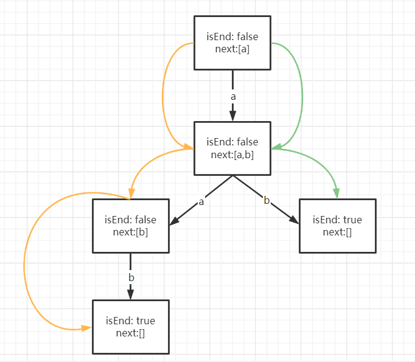

## 引言

听说过字典树吗？没听说过你可能觉得挺高大上，但是照着抄一遍就觉着不过如此了。

字典树一般用于某些想缩短字符串长度的情况，比如给你一组字符串数组，给每个字符串找到三个字符来唯一标识该字符串。先让这个问题在风中飘荡一会，来看看字典树是个什么鬼。😮

## 字典树定义
字典树就是个🌲结构，只不过他的子节点代表了在他之后会出现的字符。我们要做的就是把一个个字符串加入到字典树中，让这棵树帮我们存储所有字符串。举个🌰，把字符串ab和aab加入到字典树中，则字典树的结构如下：



喏，通过橙色路径我们可以得到ab，通过绿色路径我们可以得到aab。有没有发现，他们都停在了isEnd=true的节点上。😲

其实这里的isEnd表示的是否存在一个字符串以该点为结束点，next数组则指向那些以根节点到该节点的路径为前缀，之后还存在其他字符的情况。（根节点向来不存储东西，只是一个空节点）

## 实例详解

好了，来看看文章开始那个还在风中🪁飘荡的问题。

给定一组字符串，为每个字符串找到三个字符简写，使得该简写可以唯一标识该字符串。如果每个字符串都存在一个简写则返回1，否则返回0。

注：字符串仅由大写英文字母组成。且每个字符串长度最小为3。

示例1：
> 输入：NEWYORK,NEWZEALAND,NEWZOO
> 
> 输出：1
> 
> 解释：三个字符串可分别用NEY，NEZ，NEO表示。因此能够为每个字符串找到一个简写。

参考代码：

```Go
package main

import (
	"bufio"
	"fmt"
	"os"
	"strings"
)

//难在构建tree的insert函数上，只要记住也就没问题了
//tree中参数应该cnt还是isEnd，视情况而定
//有可能字符串中的字符不只局限于小写字母，那可以用map

type Trie struct {
	cnt  int
	next map[uint8]*Trie
}

func InitTrie() *Trie {
	return &Trie{
		cnt:  1,
		next: make(map[uint8]*Trie, 0),
	}
}

func (t *Trie) Insert(word string) {
	peer := t
	for i := 0; i < len(word); i++ {
		temp := word[i] - 'A'
		if peer.next[temp] == nil { //如果要找的节点为空，则创建一个
			peer.next[temp] = InitTrie()
		} else {    //否则直接在原来基础上加一
			peer.next[temp].cnt++
		}
		peer = peer.next[temp]  //指针指向下一个节点
	}
}

func (t *Trie) Search(word string) bool {
	peer := t
	for i := 0; i < len(word); i++ {
		temp := word[i] - 'A'
		if peer.next[temp].cnt == 1 {
			return true
		}
		peer = peer.next[temp]
	}
	return false
}

func main() {
	reader := bufio.NewReader(os.Stdin)
	str, _ := reader.ReadString('\n')
	str = strings.ReplaceAll(str, "\t", "")
	str = strings.ReplaceAll(str, "\r", "")
	str = strings.ReplaceAll(str, "\n", "")
	temps := strings.Split(str, ",")
    //1
	tree := InitTrie()
	for _, word := range temps {
		tree.Insert(word)
	}
    //2
	for _, word := range temps {
		if !tree.Search(word) {
			fmt.Println(0)
			return
		}
	}
	fmt.Println(1)
}
```

哎呀🥶，一不小心把代码全贴上来了，来拆开看看🥢

我们定义了一个结构体叫Trie，他里面有一个cnt，有一个next数组。

- next数组，没说的，就是前面字典树定义时候提到的那个家伙。这里由于题目说明字符串中只有26个大写字母，所以我们规定next数组是一个长度为26的节点数组，其中next[0]表示下一个节点为A，next[25]则表示下一个节点为Z。

- cnt，是说在加入树的字符串中，以从根节点到当前节点的路径为前缀的字符串的个数。

这个结构体还有两个函数。
- Insert函数，它会将一个字符串加入到字典树。具体做法是：以根节点为当前节点，从头遍历字符串的每一个字符，查看当前节点的next数组中是否存在该字符，不存在则新建一个节点，将其赋值给next数组的对应位置，存在则直接将这一节点的cnt值+1。

Search函数，按下不表，咱们先来看看怎么应用这个建好的字典树。目前我们已经走到了main函数的2号点位置，已经将所有字符串加到字典树里面了。那么想要确定是不是每个字符串都存在一个简称，可以唯一标识他自己，**其实就是遍历它在字典树中的节点，看看哪一个节点的cnt=1，这时候只要把这个节点和他前缀的一部分组成一个简称，就可以唯一标识他自己。**

细细品来，我们就可以让Search函数实现这一个寻找cnt=1的功能。具体来说，就是按照Insert函数的顺序从头遍历字符串的每个字符，当查找到某个节点——该节点的cnt为1，即以从根节点到该节点的路径为前缀的字符串只有一个，且就是当前这个字符串——这个时候，就一定存在一个简称来唯一标识该字符串。如NEWYORK，当查找到Y节点的时候，它的cnt就是1，那么我们可以用NEY、NWY、EWY其中的一个来标识它，总之只要带上Y就一定能唯一标识它。

okay了，恍恍惚11 o'clock🕚了。